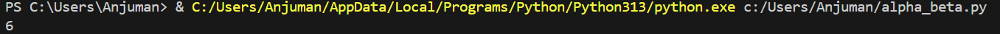

# Alpha-Beta Pruning

## How it works
Optimizes the Minimax algorithm by pruning branches that cannot affect the final decision. Uses two values: Alpha (best for maximizer) and Beta (best for minimizer). Prunes branches when possible.

## Applications
- Efficient game-tree pruning (Chess engines, Tic Tac Toe, Checkers)
- Any Minimax-based AI

## Complexity
- **Time:**
  - Best: O(b^(d/2))
  - Worst: O(b^d)
- **Space:** O(d)

## Input & Output Example

