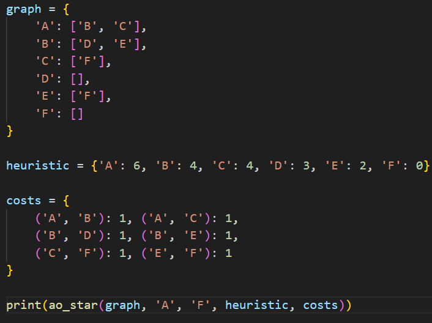
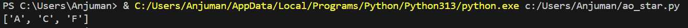

# AO* Algorithm

## How it works
AO* (And-Or Star) is an extension of A* for AND-OR graphs, where solving a problem may involve OR nodes (choose one) and AND nodes (satisfy all). Uses heuristics and builds a solution graph with backtracking and cost updates.

## Applications
- Expert systems
- Automated planning and reasoning
- Hierarchical problem solving

## Complexity
- **Time:** Exponential (depends on branching factor, AND/OR combinations, heuristic)
- **Space:** Exponential (solution graph and backtracking)

## Input & Output Example

