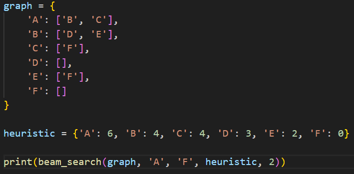
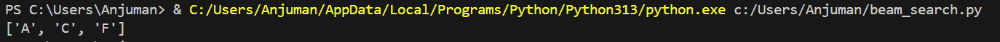

# Beam Search

## How it works
At each level of the search tree, keeps only the best k nodes (beam width) based on heuristic score and discards the rest. Memory-efficient due to pruning.

## Applications
- Natural Language Processing (NLP)
- Machine translation
- Text generation
- Speech recognition

## Complexity
- **Time:** O(k × d)
- **Space:** O(k × d)

## Input & Output Example

