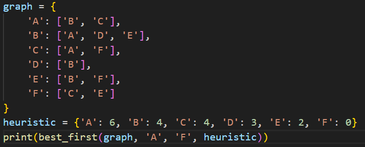
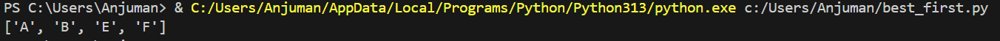

# Best-First Search

## How it works
Uses a heuristic function to evaluate which node appears closest to the goal. Expands the node with the lowest heuristic cost (Greedy Best-First Search).

## Applications
- Pathfinding (navigation systems)
- Puzzle solving (8-puzzle)
- Game AI
- Web crawling

## Complexity
- **Time:** O(b^m)
- **Space:** O(b^m)

## Input & Output Example

