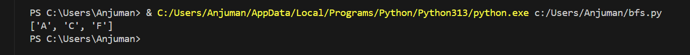
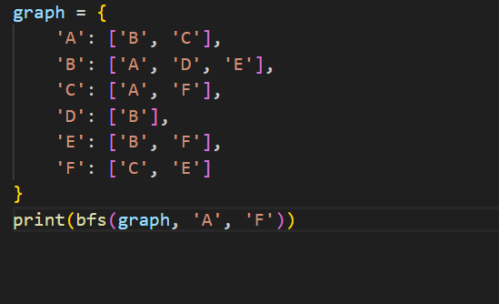

# Breadth-First Search (BFS)

## How it works
BFS explores nodes level by level from the start node using a queue (FIFO). It visits all neighbors at the current depth before moving to the next level.

## Applications
- Finding shortest path in unweighted graphs
- Social networking (degree of connection)
- Web crawlers
- Broadcasting in networks

## Complexity
- **Time:** O(V + E)
- **Space:** O(V)

## Input & Output Example

