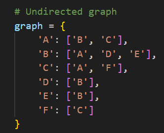
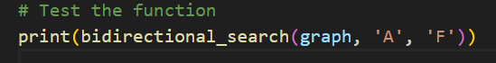
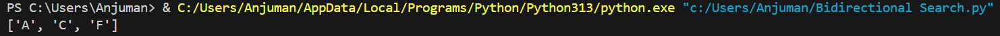

# Bidirectional Search

## How it works
Runs two simultaneous searches: one forward from the start node and one backward from the goal node, until they meet.

## Applications
- Finding shortest path in maps and graphs
- Route planning (e.g., GPS navigation)
- Puzzle solving (e.g., 8-puzzle)

## Complexity
- **Time:** O(b^(d/2))
- **Space:** O(b^(d/2))

## Input & Output Example

