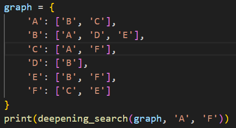
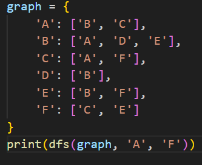

# Iterative Deepening Search (IDS)

## How it works
IDS combines DFS and BFS by performing DFS with increasing depth limits until the goal is found. It is memory efficient like DFS but finds the shallowest solution like BFS.

## Applications
- Memory-efficient search
- Game trees (e.g., chess, checkers)

## Complexity
- **Time:** O(b^d)
- **Space:** O(d)

## Input & Output Example

