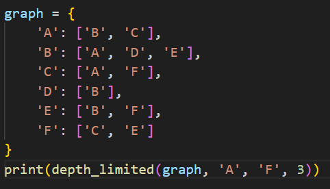

# Depth-Limited Search (DLS)

## How it works
Performs DFS but with a predefined depth limit. Nodes beyond this depth are not expanded.

## Applications
- Searching in infinite or very large search spaces
- When solution depth is known or bounded
- Web crawling with depth restrictions
- AI planning

## Complexity
- **Time:** O(b^l)
- **Space:** O(l)

## Input & Output Example

