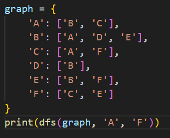
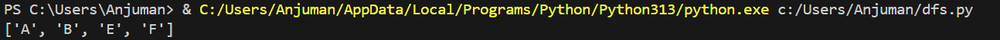

# Depth-First Search (DFS)

## How it works
DFS explores as far as possible along each branch before backtracking, using a stack (LIFO) or recursion.

## Applications
- Solving mazes
- Topological sorting
- Pathfinding
- Cycle detection in graphs

## Complexity
- **Time:** O(V + E)
- **Space:** O(V)

## Input & Output Example

