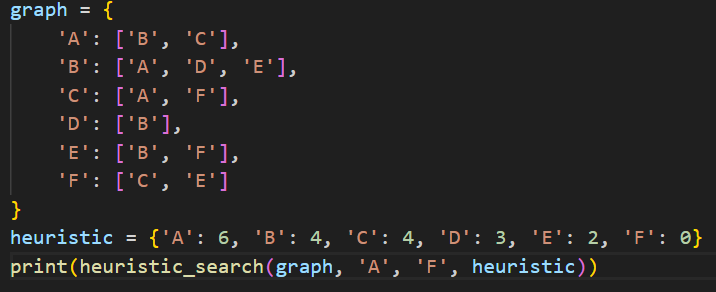
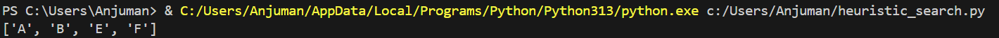

# Heuristic Search

## How it works
Uses a heuristic function to estimate the cost from a node to the goal, prioritizing nodes that appear closer to the goal.

## Applications
- Puzzle solving (e.g., 8-puzzle)
- Game playing (e.g., chess, tic-tac-toe)
- Pathfinding (e.g., A*)
- Robotics and planning

## Complexity
- Depends on the heuristic:
  - Good heuristic: reduces time and space
  - Poor heuristic: can degrade to uninformed search

## Input & Output Example

