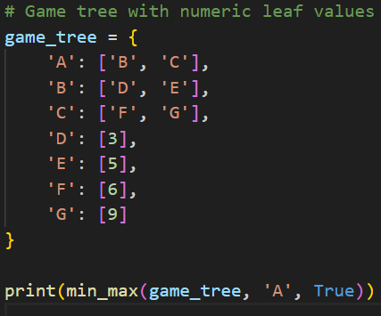
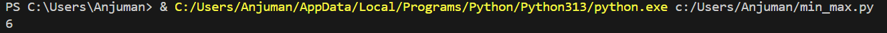

# Minimax Algorithm

## How it works
Used in two-player, turn-based, zero-sum games. Recursively explores the game tree, assuming one player maximizes and the other minimizes the score. Selects the move that maximizes the minimum possible loss.

## Applications
- Game AI (Tic Tac Toe, Chess, Checkers, Connect Four)

## Complexity
- **Time:** O(b^d)
- **Space:** O(d)

## Input & Output Example

